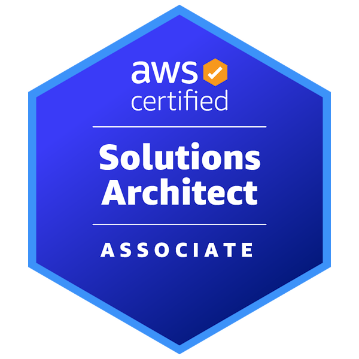

# Hi, I'm Astle E.M

<table>
  <tr>
    <td width="160px" align="center" valign="top">
      
       
      <b>AWS Certified</b>
    </td>
    <td valign="top">
      <h3>DevOps Engineer | AWS Solutions Architect | Automation Enthusiast</h3>
      
I am a DevOps-focused engineer dedicated to building scalable, automated, and highly available cloud infrastructure. With a strong foundation in enterprise server environments, I specialize in modernizing workflows through CI/CD, containerization, and AWS cloud architecture.

    </td>
  </tr>
</table>

---

### 👨‍💻 About Me
I am a DevOps-focused engineer dedicated to building scalable, automated, and highly available cloud infrastructure. With a strong foundation in enterprise server environments, I specialize in modernizing workflows through CI/CD, containerization, and AWS cloud architecture.

*   🚀 **Current Focus:** Advanced Terraform modules and Kubernetes orchestration.
*   🛠️ **Tech Stack:** AWS (EC2, S3, RDS), Docker, Jenkins, and Git.
*   ⚙️ **Background:** 3+ years of deep infrastructure experience, providing a solid backbone for cloud-native migrations.
*   🧪 **Recent Project:** Developed Infrastructure-as-Code (IaC) scripts for consistent and repeatable cloud environment deployments on AWS.

---

### 🛠️ Technical Arsenal
*   **Cloud:** AWS (VPC, EC2, S3, IAM, CloudWatch)
*   **DevOps:** Docker, Jenkins, Git, CI/CD Pipelines
*   **Scripting:** PowerShell, Python, Bash
*   **Database:** SQL Server Management & Performance Tuning

---

### 📫 Connect with me

